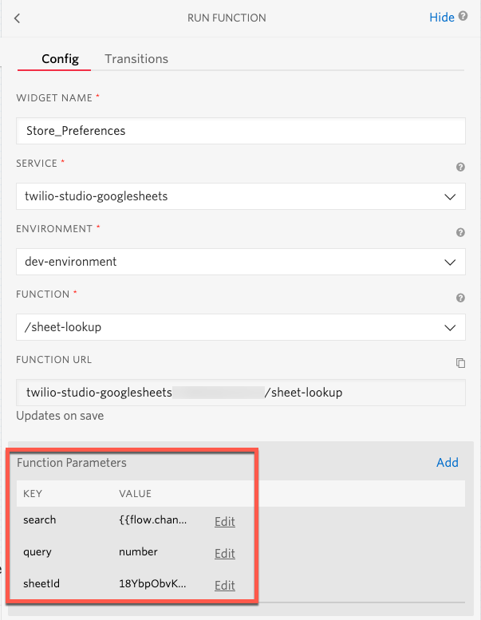

# twilio-studio-googlesheets

This function provides a quick way to read data from a Google Sheet. Combine this data with Twilio Studio to dynamically control a Studio Flow.

## Deployment

This function was built to be quickly deployed to Twilio Serverless using the Twilio CLI. If the CLI is not already installed, follow these [instructions](https://www.twilio.com/docs/twilio-cli/quickstart)

Copy sample.env to .env and set the following

> ACCOUNT_SID=ACXXXXXXXXXXXX\
> AUTH_TOKEN=XXXXXXXXXXXXXXX\
> GOOGLE_API_KEY=

A Google Sheets API key will allow this function to read data from public sheets. The [documentation](https://www.npmjs.com/package/google-spreadsheet) for the google-spreadsheet package contains authentication details.

Run `npm install`

Finally run `npm run deploy` to deploy the function to Twilio

## Studio Set up

Once deployed to Twilio, the function can be connected to a studio flow.

The following parameters are required:

> query - the name of the column to search against\
> search - the value to search for. For example, the callers phone number\
> sheetId - the ID of the google sheet

An object will be returned containing the matched header and row data as key value pairs.
